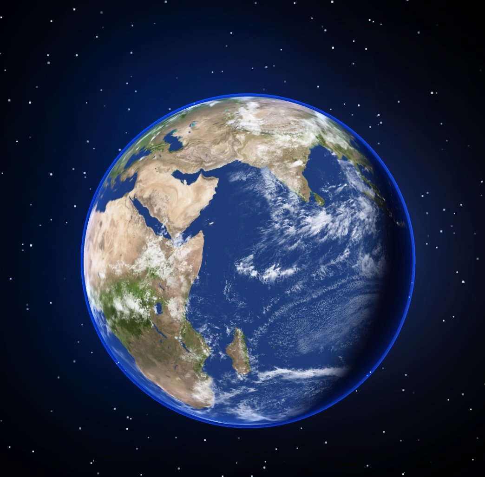

# Create the Earth with React Three Fiber 
Launch into the world of 3D web development with this React Three Fiber! Here's what we'll explore:

✨ Earth with realistic textures  
✨ Atmosphere glow using custom shaders  
✨ Shooting stars and a nebula background  
✨ Starfield animations for depth and ambiance  

Props to https://threejs-journey.com/ for help with the Earth Shader!

```
yarn
yarn dev
```
Tutorial on [YouTube](https://youtu.be/LDKlZmAqpHw)


